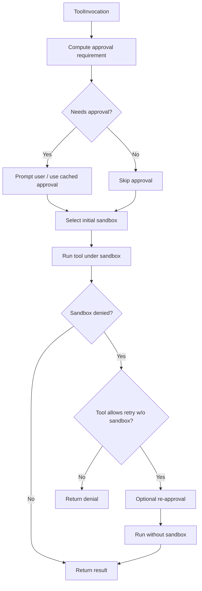

# Codex Complete Detailed Specification

Purpose: define behavior, protocols, data formats, tooling, and runtime semantics required to reimplement Codex (Rust version) in another language with full interoperability.

## 1. Architecture Overview
- Components: CLI multitool (`codex`), interactive TUI, non-interactive exec mode, app-server (JSON-RPC over stdio), MCP client/server, policy engine, sandbox runners, tool layer, and supporting utilities (apply-patch, file-search, etc.).
- Workspace: Cargo workspace (edition 2024) under `codex-rs/`; crates prefixed `codex-…`. Node wrapper (`codex-cli`) ships prebuilt binaries. TypeScript SDK spawns the CLI for automation.
- Runtime loop: CLI parses config/flags → loads auth/config → selects provider/model → builds conversation (history + docs) → streams model output + tool calls → executes tools under sandbox/approval → emits structured events to UI/clients → persists rollouts.

## 2. Protocols & Wire Formats
- Core protocol types live in `codex-rs/protocol` (re-exported by `codex-core`). Key enums: `EventMsg`, `ResponseItem`, `ResponseInputItem`, `AskForApproval`, `SandboxPolicy`, turn/thread metadata, plan/update events, view-image events, exec command begin/end, patch apply begin/end, turn diff.
- Serialization: JSON via serde defaults; snake_case fields; optional fields omitted when None.
- Exec JSONL (exec mode): every event is a JSON object per line; stdout must contain only JSONL in `--json` mode; human mode prints final message only (no stray logs).
- App-server JSON-RPC (stdio): method names `initialize`, `thread/start|resume|list|archive`, `turn/start|interrupt`, `review/start`; notifications `initialized`, `thread/started`, `turn/started`, `item/*`, `turn/completed`, etc. Schema generated by `app-server-protocol` (TS/JSON schema available via `codex app-server generate-*`).
- MCP: client connects to configured servers on startup; server mode exposes Codex tools via MCP spec; transport stdio.

## 3. Configuration & Persistence
- Config file: `~/.codex/config.toml`. CLI overrides via flags; precedence: CLI > env vars > profile > defaults. Profiles supported.
- Keys include: `sandbox_mode` (read-only|workspace-write|danger-full-access), `approval_policy` (Never|OnRequest|OnFailure|UnlessTrusted), provider settings (OpenAI base URL/key, OSS provider host/port), mcp_servers, notify hooks, history, prompts, model selection, logging.
- Sessions: stored under `~/.codex/sessions/<id>.jsonl` (rollout); archived in `~/.codex/sessions/archived`. Session meta includes preview, model provider, timestamps. `resume --last` loads most recent.
- Docs ingestion: project docs (e.g., AGENTS.md) surfaced via `project_doc` into system prompts; path resolution relative to repo root.

## 4. Authentication
- Supported: ChatGPT login (browser/device code), API key. Stored securely via keyring when available.
- Auth manager enforces login for providers that require it; API key path can bypass.

## 5. Provider & Model Selection
- Providers defined in `model_provider_info`/`openai_model_info`/`model_family`: includes id, base URL, default model, supports_images, supports_tools, apply_patch tool type, shell tool flavor (array vs string), experimental tool list.
- OSS providers: Ollama (default port 11434) and LM Studio (default 1234) via `resolve_oss_provider`; can override base URL/port.
- Default model chosen per provider; CLI `--model` overrides.

## 6. Approval & Sandbox Policies
- Approval policies: Never, OnRequest, OnFailure, UnlessTrusted. Default approval requirement computed in `default_approval_requirement`; tools may override.
- Execpolicy: Starlark `prefix_rule(pattern=[...], decision=allow|prompt|forbidden, match?, not_match?)`. Evaluated before command execution; strictest decision wins. CLI `codex execpolicy check` exposes behavior.
- Sandbox modes: read-only, workspace-write, danger-full-access. Platform backends: Seatbelt (macOS, SBPL profiles), Landlock+seccomp (Linux), Windows restricted token. Env guards: `CODEX_SANDBOX_NETWORK_DISABLED` and `CODEX_SANDBOX` used to skip unsupported tests.
- ToolOrchestrator flow: (1) approval check (possibly prompt user) (2) first attempt under selected sandbox (or none if escalation requested) (3) on sandbox denial and if allowed, optionally re-approve and retry unsandboxed.

## 7. Execution & Tools
- Tool routing: `ToolRouter` builds `ToolCall` from model `ResponseItem` (function/custom/local shell/MCP). Specs built in `spec.rs` based on model family + feature flags. Tool registry dispatches to handlers.
- Core tools & handlers: see docs/handlers/*.md (apply_patch, shell/shell_command/local_shell, unified_exec/exec_command/write_stdin, read_file, list_dir, grep_files, plan/update_plan, view_image, mcp, mcp_resource list/read/templates, test_sync). Each handler’s spec includes inputs, outputs, gotchas, sequence diagrams, and examples.
- Runtimes: ShellRuntime (execvp/CreateProcess via sandbox env), ApplyPatchRuntime (self-invoke codex with CODEX_APPLY_PATCH_ARG1), UnifiedExecRuntime (PTY sessions), all using ToolOrchestrator.
- Exec output formatting: structured JSON with metadata (exit_code, duration) or freeform; truncation via `formatted_truncate_text`, preview limits (`TELEMETRY_PREVIEW_*`). Timeouts prepend “command timed out after … milliseconds”.
- Safe-command heuristics: `is_known_safe_command` influences mutating gate.
- File diffs: `TurnDiffTracker` captures changes; apply_patch emitter sends PatchApplyBegin/End and TurnDiff events.
- MCP tools: `handle_mcp_tool_call`, resource listing/reading utilities, begin/end events with duration.

## 8. Apply-patch Grammar & Verifier
- Grammar in `handlers/tool_apply_patch.lark`. Patch envelope: `*** Begin Patch` … `*** End Patch`. File ops: Add/Delete/Update, optional Move to:, hunks with @@ headers, lines prefixed + - or space; optional `*** End of File`. File paths must be relative. Parser verifies structure and produces change map. Self-invocation: codex binary with argv[1]=CODEX_APPLY_PATCH_ARG1 and patch body.

## 9. CLI Surfaces
- `codex` (cli crate) subcommands: default TUI, exec, login/logout, mcp, mcp-server, app-server, sandbox (macos|linux|windows), execpolicy check, apply (apply latest diff), resume, cloud tasks (preview), responses-api-proxy, stdio-to-uds, completion.
- Exec mode: prompt from arg or stdin (`-` forces stdin), options for sandbox, approval, model, cwd, images (`--image`), output schema (JSON), full-auto/dangerous bypass flags, color, last message file, json mode.
- TUI: fullscreen, snapshot-tested; styling per `tui/styles.md`; uses Stylize helpers and text wrapping helpers.

## 10. Event Semantics
- ExecCommandBegin/End: contain call_id, turn_id, command vec, cwd, parsed_cmd tokens, source (Agent/Interaction), interaction_input (optional), stdout/stderr/aggregated_output, exit_code, duration, formatted_output.
- PatchApplyBegin/End: includes call_id, auto_approved, changes map, stdout/stderr, success; may emit TurnDiff with unified diff.
- PlanUpdate, ViewImageToolCall, MCP tool call begin/end (with duration and result), TurnDiff events emitted after patch or diff tracking.
- Ordering: begin before runtime, end after runtime; failures emit Failure stage with message or output; emitter handles transformation of ToolError into FunctionCallError.

## 11. Config-driven Feature Flags
- `features` module lists known flags (ApplyPatchFreeform, WebSearchRequest, ViewImageTool, UnifiedExec, ShellTool, etc.). Tools included/excluded based on model family + features. Experimental tool names surfaced via `experimental_supported_tools` list.

## 12. Output & Truncation Rules
- Telemetry preview caps: 2 KiB or 64 lines; append “[... telemetry preview truncated ...]”.
- Truncation policies from turn context applied before model return. Freeform vs structured differences noted in shell/unified_exec.

## 13. Persistence & History Management
- Message history trimming: `truncate`/`compact` modules enforce token budgets; `content_items_to_text` converts items to text. History stored in rollout files with turn IDs and items.
- InitialHistory and ConversationManager manage loading prior items and injecting project docs/custom prompts/user instructions.

## 14. Error Handling Contracts
- Library crates deny printing to stdout/stderr; use `tracing` and event streams.
- User-visible errors via `FunctionCallError::RespondToModel` strings; fatal errors bubble as `Fatal` to CLI, terminating turn.
- Common strings (offset exceeds, must be absolute path, approval policy rejection, sandbox timeout/denied, rg timed out, etc.) are stable and asserted in tests.

## 15. Auth & Approval UI
- CLI approval prompts surface risk summaries (sandbox denial reasons) and obey policy: OnRequest prompts for escalations; Never/OnFailure skip prompts unless tool demands.
- Approval caching: approvals keyed per tool (command+cwd+escalation); ApprovedForSession stored in session services.

## 16. Sandboxing Details
- Seatbelt SBPL policies stored in `core/sandboxing/seatbelt_*.sbpl`; Landlock/seccomp via `linux-sandbox` crate; Windows uses restricted token crate.
- SandboxManager selects backend based on platform and policy; `SandboxAttempt::env_for` transforms CommandSpec to ExecEnv with sandbox wrapper binaries (Linux: codex_linux_sandbox_exe when provided).

## 17. External Dependencies & Binaries
- Requires `rg` for grep_files handler; `apply_patch` uses self binary; patched bash/exec wrappers distributed in shell-tool-mcp package; dotslash support in install docs.
- OTEL exporters via `otel` crate; tracing configuration through env (`RUST_LOG`).

## 18. Testing & Snapshots
- Run `just fmt` after Rust changes; `just fix -p <crate>` for lints; tests per crate (`cargo test -p crate`). Core/common/protocol changes require `cargo test --all-features` (ask user interactively per AGENTS rules). TUI snapshots via `cargo test -p codex-tui`, inspect `.snap.new`, accept with `cargo insta accept -p codex-tui`.
- Test utilities: `core_test_support::responses` for SSE; `mcp_test_support`; `app_test_support`.

## 19. Packaging & Distribution
- Node wrapper (`codex-cli/bin/codex.js`) selects target triple, sets PATH (including vendor/path helpers), sets `CODEX_MANAGED_BY_*` env, forwards signals, and mirrors exit code/signal of child.
- npm package contents: `bin/` launcher + `vendor/` binaries. Homebrew cask downloads the same bundles.

## 20. UI/UX Conventions
- TUI uses Stylize helpers; avoid `.white()`. Text wrapping via `textwrap` helpers; indent options prefer built-in indent features. Snapshot output must match expected spans/colors.
- Human output: concise; no extra newlines; approval/rejection messages standardized.

## 21. Non-functional Requirements
- No stdout/stderr prints in library code; clippy denies. Use tracing.
- Avoid unsigned integers; inline format! arguments; collapse nested ifs; prefer method refs over closures.
- Tests prefer whole-object equality and `pretty_assertions::assert_eq`.

## 22. Extensibility Guidance
- To add tools: create ToolSpec, handler, (optional) runtime, register in registry builder, gate with features/model family, add tests, document in docs.
- Provider additions: extend model_provider_info and client; ensure apply_patch/tool support flagged appropriately; update docs.
- Keep approval/sandbox integration consistent with ToolOrchestrator.

## 23. Executable Examples (CLI & JSON)
- Run exec mode with JSONL stream and apply patch auto-approval disabled:
```bash
codex exec --json --sandbox workspace-write --approval-policy on-request "List repo status" \
  --output-schema schema.json
```
- Start app-server and generate TS schema (stdout):
```bash
codex app-server generate-ts --out /tmp/app-schema
codex app-server
```
- Use MCP server mode (stdio) for external client:
```bash
codex mcp-server
```
- Example `exec_command` tool payload (PTY) to send via app-server or SDK:
```json
{
  "tool": "exec_command",
  "arguments": {
    "cmd": "python -i",
    "cwd": "/repo",
    "with_escalated_permissions": false
  }
}
```
- Example `apply_patch` freeform payload:
```
*** Begin Patch
*** Update File: src/main.rs
@@
-println!("Hi");
+println!("Hello");
*** End Patch
```
- Example execpolicy check:
```bash
codex execpolicy check --policy ~/.codex/policy/default.codexpolicy git push origin main --pretty
```
- Example MCP resource read payload:
```json
{ "tool": "read_mcp_resource", "arguments": { "server": "figma", "uri": "memo://123" } }
```

## 24. Mermaid Diagrams

### High-level Turn Flow
```mermaid
flowchart TD
  A[CLI/TUI input] --> B[Config/Auth load]
  B --> C[Conversation setup\n(history + docs + prompts)]
  C --> D[Model stream]
  D --> E{Tool call?}
  E -- No --> F[Stream text to UI/client]
  E -- Yes --> G[ToolRouter -> Handler -> Runtime]
  G --> H[ToolOrchestrator\napproval+sandbox]
  H --> I[Execute tool]
  I --> J[Events + outputs formatted]
  J --> D
  F --> K[Persist rollout + exit]
```

### ToolOrchestrator Sandbox/Approval

